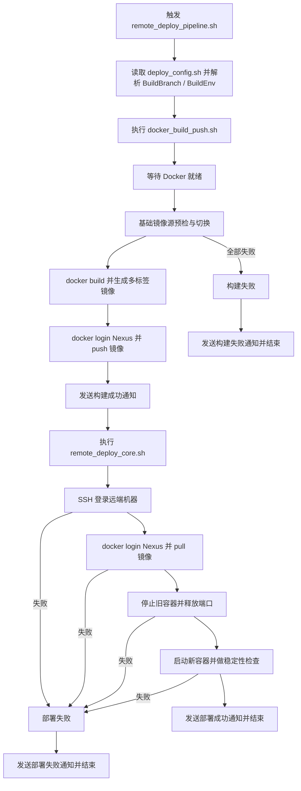

# deploy_server 部署脚本说明

脚本目录：`deploy_shell/deploy_server/`

统一配置方式：在后端工程根目录维护 `deploy_config.sh`，脚本自动加载。

## 脚本清单

- `remote_deploy_pipeline.sh`：总控脚本（构建、部署、通知，推荐入口）
- `docker_build_push.sh`：构建并推送 Docker 镜像到 Nexus 私仓
- `remote_deploy_core.sh`：远端拉取 Nexus 镜像并重启容器（分步调试）
- `send_notification.sh`：企业微信通知
- `common.sh`：公共函数
- `base_image_defaults.sh`：后端工程共享的基础镜像默认值

## 使用方式

在后端工程根目录执行（例如 `template_server` 目录）：

```bash
BuildBranch=origin/master BuildEnv=prod \
bash ../deploy_shell/deploy_server/remote_deploy_pipeline.sh --config "$PROJECT_ROOT/template_server/deploy_config.sh"

BuildBranch=origin/develop BuildEnv=test \
bash ../deploy_shell/deploy_server/remote_deploy_pipeline.sh --config "$PROJECT_ROOT/template_server/deploy_config.sh"
```

可选分步调试：

```bash
BuildBranch=origin/master BuildEnv=prod \
bash ../deploy_shell/deploy_server/docker_build_push.sh --config "$PROJECT_ROOT/template_server/deploy_config.sh"
BuildBranch=origin/master BuildEnv=prod \
bash ../deploy_shell/deploy_server/remote_deploy_core.sh --config "$PROJECT_ROOT/template_server/deploy_config.sh"
```

本地 Docker 约定：

- macOS 本地构建默认跟随当前 `docker` CLI 指向的 context / endpoint。
- 当前标准用法是 Docker CLI 指向 Colima。
- 当当前 context 指向 Colima 且 daemon 未就绪时，`docker_build_push.sh` 会尝试启动对应的 Colima profile。
- 如需显式指定 profile，可设置 `DOCKER_COLIMA_PROFILE`；如需完全关闭 Darwin 下的自动启动逻辑，可设置 `DOCKER_AUTO_START_ON_DARWIN=false`。

## YAML 配置注意事项

- 后端业务配置统一来自 `template_server/config` 目录下的模板 YAML。
- 本地默认入口仍是 `config/config.yaml`，但工作区标准部署不再把仓库内 YAML 直接复制进镜像。
- CICD / 本地部署会根据 `BuildEnv` 选择：
  - `BuildEnv=test` -> `config/config.dev.yaml`
  - `BuildEnv=prod` -> `config/config.prod.yaml`
- 这两个文件只能保存非敏感配置和 `{{ secret \`...\` }}` 占位符。
- 真实 secret 必须放在服务器侧 `workspace_secret_base` bundle 中，部署时在目标机器渲染为最终 `config.yaml`，再以只读方式挂载包含该文件的 `/app/config` 目录。
- 修改模板 YAML 或 bundle 后，都必须重新执行 `remote_deploy_core.sh` / `remote_deploy_pipeline.sh` 才会重新渲染运行时配置。
- `workspace_secret_base` 的运行时配置目录与审计日志目录应由远端部署用户创建和维护，不要因为 Docker 需要 `sudo` 就把这两类目录也创建成 root 所有者。
- `docker restart` 只会重启已有容器进程，不会重新渲染配置，也不会切换新的 bundle 内容。

## Jenkins 参数说明

- `BuildBranch`：构建分支（例如 `origin/master` / `origin/develop`，默认 `master`）
  - 支持 `origin/master`、`refs/heads/master`、`master`，脚本会自动归一化为 `master`
- `BuildEnv`：部署环境（`test` / `prod`，默认 `test`）
  - 内部链路与通知展示统一使用 `test` / `prod`
- `JENKINS_BUILD_URL_BASE`：Jenkins 任务基础地址（在 `deploy_config.sh` 中配置），例如 `https://jenkins.example.com/job/your_server_job`
  - 通知会自动拼接为：`${JENKINS_BUILD_URL_BASE}/${BUILD_NUMBER}/`
  - 企业微信通知统一使用 markdown 消息，正文结构与 SSL 巡检通知保持一致
  - 当能解析出本次构建地址时，消息末尾会附“查看 Jenkins 构建”链接

## Nexus 私仓约定

- 默认推送入口：`docker-hosted.xdarren.com`
- 默认拉取入口：`docker-hosted.xdarren.com`
- 默认命名空间：`server`
- 默认登录用户：`admin`
- 默认登录密码：`admin123`
- 默认凭证已固化在 `deploy_shell/deploy_server/common.sh`
- 如未显式提供 `NEXUS_DOCKER_PASSWORD` 或 `NEXUS_DOCKER_PASSWORD_FILE`，脚本会直接回落到默认 `admin/admin123`
- 如需覆盖地址，可在 `deploy_config.sh` 或执行环境中设置：
  - `NEXUS_PUSH_REGISTRY`
  - `NEXUS_PULL_REGISTRY`
  - `NEXUS_IMAGE_NAMESPACE`
  - `NEXUS_DOCKER_USERNAME`
  - `NEXUS_DOCKER_PASSWORD`
  - `NEXUS_DOCKER_PASSWORD_FILE`

Jenkins 优化：

- 当脚本识别到当前运行在 Jenkins 构建环境，且未显式覆盖 `NEXUS_PUSH_REGISTRY` 时，构建阶段会优先改走本机 Nexus connector `127.0.0.1:8082` 推送镜像。
- 远端部署阶段默认仍然拉取公网可达的 `docker-hosted.xdarren.com`，避免把远端机器误指到它自己的 `127.0.0.1`。
- 当前共享 Jenkins 构建机也统一使用同一组固定凭证：`admin/admin123`
- 后续若需要修改 Nexus 密码，必须同步更新：
  - `deploy_shell/deploy_server/common.sh`
  - Jenkins 主配置中的 `NEXUS_DOCKER_USERNAME` / `NEXUS_DOCKER_PASSWORD`
- 本地 Nexus 的端口和仓库初始化方式见 `/Users/darrenyou/darren_space/agents_tools/nexus/README.md`。

## 行为说明

- 已完全移除 Gitee 制品仓库、`git clone/fetch`、`docker save/load` 归档链路。
- 构建阶段直接把镜像推送到 Nexus 私仓，部署阶段通过 SSH 登录远端主机后执行 `docker login + docker pull`。
- Docker 就绪检测现在按当前 Docker CLI 的 context / endpoint 判断，本地标准环境收口为 Colima。
- 远端部署阶段支持私仓登录超时、拉取超时与拉取重试；容器启动失败仍首失败即返回失败通知。
- 基础镜像默认值统一定义在 `deploy_shell/deploy_server/base_image_defaults.sh`。
- 业务工程中的 `deploy_config.sh` 不再维护 `BASE_IMAGE_REGISTRY`、`BUILDER_BASE_IMAGE`、`RUNTIME_BASE_IMAGE`、`BASE_IMAGE_REGISTRY_CANDIDATES`。

## 部署后验证

建议至少执行以下检查：

```bash
curl -i https://your-api-domain.example.com/api/v1/health
```

若本次部署改动涉及登录、支付、回调或第三方集成，再补充验证对应业务接口或页面。

若本次改动涉及 YAML 配置，建议额外确认：

```bash
sudo docker ps --format 'table {{.Names}}\t{{.Image}}\t{{.Ports}}'
sudo docker exec <container_name> sh -lc 'for f in /app/config/config.yaml config/config.yaml; do [ -f "$f" ] && { echo "== $f =="; cat "$f"; break; }; done'
```

## 构建部署流程图


